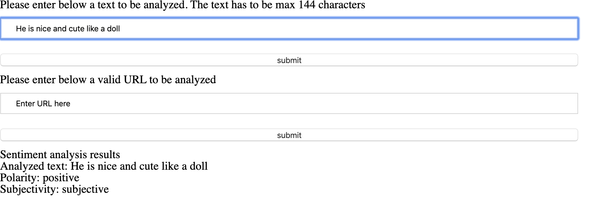
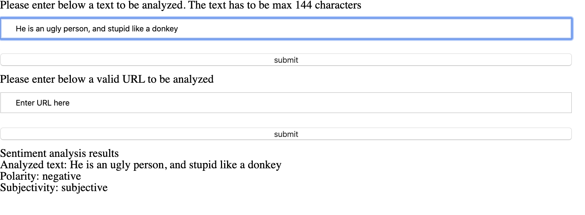
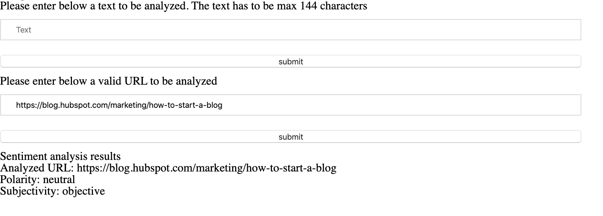

## Project overview

Front End Development Nanodegree - News Article with Natural Language Processing.

## Description

Using Aylien API, the app will analyze an user provided text and return whether the sentiment is:

- positive / neutral / negative
- objective / subjective

### Text analysis

Provide a text of a maximum 144 characters and in one of the three supported languages: English, German or Spanish.
If any of these conditions aren't fullfilled, the page will display an error message

**Example of a positive sentence**



**Example of a negative sentence**



### URL analysis

**Example of URL**

Provide a valid URL. If the URL isn't valid, an error message will be displayed



## Getting started

Clone the project on your local machine. Make sure you have `node` installed and run the following commands

```javascript
npm i
npm run build-prod
npm run start
npm run build-dev
```

### Development mode

:link: [http://localhost:9000](http://localhost:9000)
:open_file_folder: webpack.dev.conf

### Production mode

:link: [http://localhost:8081](http://localhost:8081)
:open_file_folder: webpack.prod.conf

## Lessons learned

- _webpack-dev-server_ will refresh just the client side, it still needs the server side started
- the `app.use()` path is relative to the path from where the server is started (i.e. if we start the server from the root or from the server folder)

## To do

- [ ] add static code analyzer
- [ ] add CI and deployment i.e. using Travis and Heroku
- [ ] refactor formHandler since the two handlers (text and url) share a lot of common code

## Contact

:mailbox_with_mail: theo.registrations@icloud.com
